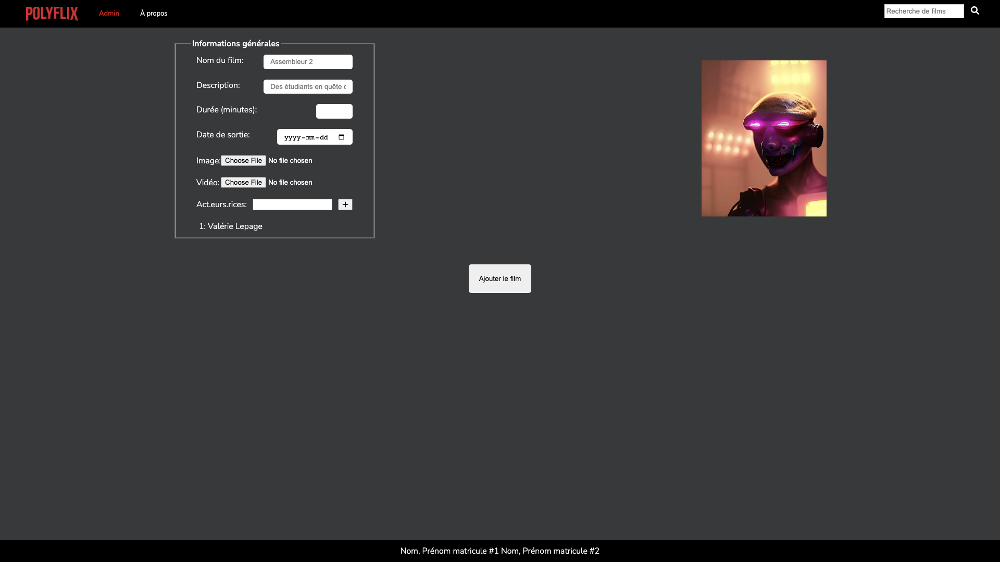

# TP1

Le but de ce travail pratique est de vous familiariser avec **HTML** et **CSS**. Vous allez élaborer la structure de pages web en utilisant HTML, mettre en place l’interaction entre les différentes pages à l’aide des hyperliens et vous aurez à reproduire les maquettes des différentes pages du site web qui vous sont fournies ici. Vous pourrez aussi vous familiariser avec l’exécution de test de bout en bout avec la librairie Cypress.

## Installation des librairies nécessaires

Vous aurez besoin de l'environnement d'exécution NodeJS et le gestionnaire de paquet npm. Vous pouvez les installer sur votre machine à partir du [lien suivant](https://nodejs.org/en/download/). On vous recommande d'installer la version *LTS*.

Pour installer les dépendances nécessaires, lancez la commande `npm ci` dans le répertoire `site-web`. Ceci installera toutes les librairies définies dans le fichier `package.json` avec les versions exactes définies dans `package-lock.json`.

## Exécution des tests

Vous pouvez exécuter les tests automatisés avec la commande `npm run test`. Ceci lancera l'outil Cypress pour l'exécution des tests dans le fureteur de votre choix. La commande `npm run test:headless` exécute les tests dans un terminal sans ouvrir un fureteur dédié. Comme Cypress utilise Chrome pour exécuter les tests, il est donc nécessaire de télécharger <a href="https://www.google.com/intl/en_ca/chrome/">Chrome</a> sur votre machine si ce n'est pas déjà fait. C'est d'ailleurs avec Chrome que l'ensemble des travaux pratiques seront corrigés.

Consultez le fichier [TESTS.MD](./TESTS.MD) pour une description détaillée de l'outil Cypress.

**Note** : commencez par les tests de `intro.cy.js` qui ne valident que le HTML/CSS de l'élément `<footer>`. Initialement, les tests pour le bas de page vont échouer puisque leur code n'est pas complet. On vous recommande **fortement** de commencer par compléter cette partie du TP en premier en utilisant les tests comme guide. Lisez bien le code dans `shared.js` pour mieux comprendre le résultat attendu.

## Déploiement local

Vous pouvez faire un déploiement local de votre site avec l'outil `http-server`. Si vous lancez la commande `npm start` dans le répertoire `site-web`, un serveur HTTP statique sera déployé sur votre machine et votre site sera accessible sur l'adresse `localhost:3000` ou `<votre-adresse-IP>:3000`. La sortie dans le terminal vous donnera l'adresse exacte d'accès.

## Documentation

La documentation pour ce travail pratique utilise <a href="https://www.markdownguide.org/">Markdown</a>. Vous pouvez utiliser la fonctionnalité de prévisualisation directement dans Visual Studio pour faciliter la lecture des fichiers `.md`.

## Description du travail à compléter

## Règles CSS

Votre travail utilisera un mélange de règles CSS internes (faites par vous) et externes. La police `Nunito Sans` de Google vous est déjà fournie dans le code de départ.

Vous allez utiliser la librairie `FontAwesome` pour les icônes dans vos pages. Vous devez utiliser la version `6.1.2` dont l'URI est : `https://use.fontawesome.com/releases/v6.1.2/css/all.css`. Le reste du code CSS à compléter par vous se trouve dans le fichier `styles.css`. Quelques règles et sélecteurs vous sont fournis pour vous aider à débuter le travail.

### Thème visuel du site

Le fichier `styles.css` contient quelques variables CSS avec des valeurs prédéfinies pour les couleurs principales du site. Les captures d'écran fournies utilisent ces couleurs. Basez-vous sur les noms fournis pour comprendre leur rôle. Vous êtes libres à changer les couleurs si vous voulez, mais ceci ne devrait pas affecter la lisibilité du site.

## Entête et bas de page

Pour ce travail pratique, vous devez d’abord élaborer la structure des pages HTML qui composeront votre site web. Cette structure devra être définie à l’aide des balises sémantiques de HTML telles que les balises `<header>`, `<nav>`, `<main>` et `<footer>`. Les sous-sections qui suivent décrivent les différentes pages à réaliser.

    

### Entête

L'entête contient 2 sections placées aux extrémités, mais pas collées aux bords de la page. Toutes les pages partagent le même entête.

La première section contient une barre de navigation avec le logo du site d'une largeur fixe de votre choix qui redirige vers la page principale et 2 liens vers la page `admin` et `about`.

Lorsque la page `admin` ou `about` est sélectionnée, l'élément qui correspond au nom de la page dans la barre de navigation doit être en gras avec une couleur prédéfinie. Ce n'est pas le cas pour `index` ou `movie`.

    

Lorsqu'un utilisateur passe sa souris par-dessus l'un des éléments de la barre de navigation, l'élément devrait être souligné.

    

La deuxième section contient une barre de recherche composée d'un champ de saisie avec une valeur temporaire et un bouton de recherche (classes `fa-2x fa-search` de FontAwesome). Le bouton devrait transformer le curseur en pointeur lorsque survolé par la souris. Référez-vous aux tests dans le fichier `shared.cy.js` pour les identifiants à utiliser pour les éléments de la barre de recherche.

L'entête doit changer son visuel lorsque la taille d'écran est réduite en bas de 800px. Consultez la section sur la page [index.html](#page-indexhtml) pour plus d'informations.

### Bas de page

Cette section doit toujours être placée en bas de la page, occuper la totalité de sa largeur et être de la couleur de fond principale du site. Le bas de page est le même pour toutes les pages du site.

La section contient le nom et matricule de chaque membre de l'équipe centrés avec un identifiant unique. Référez-vous aux tests dans le fichier `shared.cy.js` pour les identifiants à utiliser.

## Page "about.html"

La page `about.html` devrait être similaire à celle-ci. Le code HTML et CSS du contenu principal vous est déjà fourni pour vous aider à débuter votre TP. Vous pouvez utiliser cette page pour vérifier le thème visuel de votre site. La couleur de fond du contenu principal doit être différente de la couleur de fond de l'entête et le bas de page.

    

## Page "index.html"

Le résultat final de la page `index.html` devrait être le suivant.

La page doit contenir 2 listes ayant les titres "Nouveautés" et "Vos recommandations" accompagnés d'une icône différente (classes `fa-solid fa-film` et `fa-solid fa-heart` de FontAwesome).

Chaque liste doit contenir les affiches pour les films du site dans une rangée. La couleur de fond des listes doit être différente des autres couleurs de fond dans le site. Les affiches doivent être espacées de manière uniforme et doivent rediriger l'utilisateur vers la page `movie` suite à un clic dessus.

Les différentes listes et affiches doivent partager des classes CSS pour leur visuel. Référez-vous aux tests dans le fichier `index.cy.js` pour les identifiants et classes à utiliser pour ces éléments.

Chaque affiche a une taille de `300px : 240px` ou un ratio de hauteur/largeur de `5:4`.  

Vous trouverez les informations détaillées des films dans le fichier `films.json`. Vous pouvez utiliser le même ordre des affiches que dans la capture d'écran plus bas.

Lorsqu'un utilisateur passe sa souris par-dessus une affiche, celle-ci devrait rapidement(0.3s) grossir, avoir une zone transparente de la taille originale, le titre du film et un bouton "jouer" (classe `fa fa-5x fa-play` de FontAwesome). _Astuce : les propriétés [transform](https://developer.mozilla.org/en-US/docs/Web/CSS/transform) et [transition](https://developer.mozilla.org/en-US/docs/Web/CSS/transition) vous seront utiles pour cet effet._ 

    

Lorsqu'un utilisateur réduit la largeur de l'écran sous les `800px`, la barre de recherche devrait apparaître sous la barre de navigation et occuper la totalité de la longueur de l'entête. L'alignement des affiches est aussi affecté : les affiches de chaque liste sont placées dans 2 colonnes.

Le comportement des affiches devrait être le même, peu importe la largeur.

    

## Page "admin.html"

La page `admin.html` devrait être similaire à celle-ci.

    

Le but de cette page est de permettre à un utilisateur d'ajouter un film. Une fois que l'ensemble des champs obligatoires sont remplis, il devient possible à un utilisateur d'envoyer le formulaire à travers un bouton "Ajouter le film".

Une image de prévisualisation pour l'affiche est disponible à droite de la page. Le choix de l'image est laissé à votre choix. Le formulaire et l'image sont centrés horizontalement. Le bouton de soumission est centré dans la page.

### Contenu du formulaire

Le formulaire contient différents champs. Ceux-ci nécessitent certaines vérifications avant l'envoi du formulaire. Sauf indication contraire, les champs sont tous obligatoires.

Les champs doivent être identifiés par un attribut `id` unique. Référez-vous aux tests dans le fichier `admin.cy.js` pour les identifiants à utiliser. Chaque champ est accompagné d'une étiquette explicative et les champs et les étiquettes sont alignés comme dans la capture d'écran fournie.

- Le nom du film doit nécessairement contenir au moins un caractère non vide. 
- La description du film doit contenir au moins 10 caractères.
- La durée d'un film doit avoir une valeur minimale de 1 minute.
- La date de sortie est nécessaire pour envoyer le formulaire.
- L'affiche du film doit être un fichier de type image.
- Le film doit être un fichier de type vidéo.
- Il n'est pas nécessaire que le champ `Act.eurs.rices` soit rempli. Ce champ est une liste déroulante avec au moins 3 choix de noms. Un bouton  avec la classe `fa fa-plus` accompagne le champ. Référez-vous aux tests dans le fichier `admin.cy.js` pour les choix obligatoires. _Astuce : l'élément HTML [datalist](https://developer.mozilla.org/en-US/docs/Web/HTML/Element/datalist) vous sera utile pour ce champ._
- Un nom doit être présent à la fin du formulaire. Le nom est laissé à votre choix.

### Spécifications en lien avec le formulaire et point bonus

Dans le cadre de ce TP, nous vous demandons d'ajouter un élément qui n'a pas été utilisé jusqu'à présent au formulaire. Ce nouveau champ n'est pas considéré comme obligatoire pour la soumission du formulaire. Si vous ajoutez un élément `<input>`, son type ne peut donc pas être un type déjà utilisé: `file`, `data`, `number`, etc. Vous pouvez vous inspirer des `<input>` à la page <a href="https://www.w3schools.com/html/html_form_input_types.asp">suivante</a>. Vous n'êtes pas limités à l'élément `<input>`.

Une fois que vous avez ajouté votre élément, votre page `movie.html` doit, elle aussi, contenir ce nouveau champ ajouté. Un point bonus sera donné en fonction de la qualité du code et de la complexité de l'ajout.

**Note** : la note maximale pour ce travail ne peut pas dépasser 20/20.

## Page "movie.html"

La page `movie.html` devrait être similaire à celle-ci. Cette page est accessible à travers un clic sur une des affiches de la page principale. Le contenu de la page est toujours le même et basé sur le film `Cyborg` décrit dans le fichier `films.json`.

    

Lorsqu'un utilisateur passe sa souris par-dessus la description du film, celle-ci devrait montrer l'entièreté de son contenu.

    

Lorsque l'utilisateur n'a pas sa souris sur la description du film, trois points devraient remplacer le contenu débordant une largeur maximale de 600px. _Astuce : la propriété [overflow](https://developer.mozilla.org/en-US/docs/Web/CSS/overflow) vous sera utile._

    

Les informations du film doivent être identifiées par un attribut `id` unique. Référez-vous aux tests dans le fichier `movie.cy.js` pour les identifiants à utiliser. L'information sur la correspondance (à quel point un film est similaire aux préférences de l'utilisateur) devrait être d'une couleur différente. La valeur exacte de cette information est laissée à votre choix.

La vidéo du film devrait contenir les contrôles par défaut d'une vidéo HTML et être centrée dans la page sans occuper la totalité de sa largeur. Un fichier `mp4` vous est fourni dans le dossier `assets/mp4` pour compléter votre page. Notez que la résolution de la vidéo d'exemple est relativement basse pour limiter sa taille.

**Rappel**: N'oubliez pas de rajouter dans cette page le champ supplémentaire que vous avez ajouté dans le formulaire.

# Correction et remise

La grille de correction détaillée est disponible dans [CORRECTION.MD](./CORRECTION.MD). Le navigateur `Chrome` sera utilisé pour l'évaluation de votre travail. L'ensemble des tests fournis doivent réussir lors de votre remise.

Le travail doit être remis au plus tard le lundi 25 septembre à 23:55 sur l'entrepôt Git de votre équipe. Le nom de votre entrepôt Git doit avoir le nom suivant : `tp1_matricule1_matricule2` avec les matricules des 2 membres de l’équipe.

**Aucun retard ne sera accepté** pour la remise. En cas de retard, la note sera de 0.