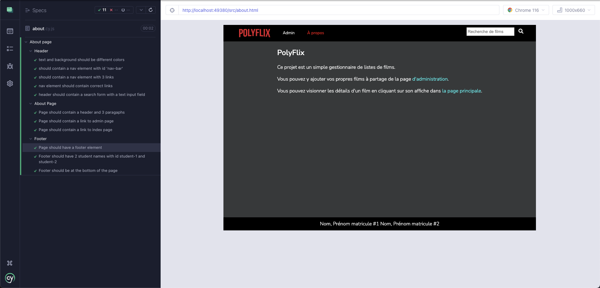

## Introduction à Cypress

La bibliothèque <a href="https://www.cypress.io/">Cypress</a> est utilisée dans ce travail pratique. Tel que mentionné précédemment, pour exécuter l'ensemble des tests, vous avez la possibilité d'utiliser `npm run test` ou `npm run test:headless`. Si vous décidez d'utiliser `npm run test`, vous devriez voir une nouvelle fenêtre apparaître.

    

Dans notre cas, on ne cherche qu'à effectuer des tests de bout en bout `E2E (End to End)`. Vous pouvez cliquer sur l'option `E2E Testing`. Une nouvelle fenêtre devrait apparaître avec plusieurs options : les navigateurs disponibles sur votre machine (sauf Safari) ou Electron.

    

Comme les travaux pratiques seront corrigés sur Chrome pour toute la durée des laboratoires, cliquez sur l'option Chrome. Si vous n'avez pas le navigateur Chrome, installez-le.

    

Vous devriez maintenant voir une fenêtre contenant nos différents fichiers de tests: about, admin, index, movie et intro. Lorsque vous cliquez sur l'un des fichiers, l'ensemble des tests de ce fichier sera exécuté.

Par exemple, en cliquant sur la page `about.html`, l'ensemble des tests sont alors effectués.

    

Dans votre cas, certains tests devraient échouer initialement comme rien n'est encore implémenté. Votre travail sera donc d'implémenter le code qui va permettre d'exécuter l'ensemble des tests pour que ceux-ci passent avec succès.

Si vous ne souhaitez pas avoir d'interface graphique, vous pouvez aussi utiliser `npm run test:headless`. Cette commande devrait exécuter l'ensemble des tests à partir de votre terminal. Vous devriez voir, en exécutant la commande, le résultat de l'ensemble des tests exécutés dans le terminal.

    

Vous devriez aussi pouvoir constater le résultat de vos tests.

    

À la remise du travail pratique, l'ensemble des tests fournis devraient réussir.

**Note** : les tests ont une certaine flexibilité. Il est donc possible que le visuel de votre TP ne soit pas exactement pareil aux exemples donnés. Vous pouvez, par exemple, changer les couleurs présentes dans les différentes variables CSS sans problème. Les tests fournis ne couvrent pas 100% des requis du TP. Certains éléments seront évalués manuellement.