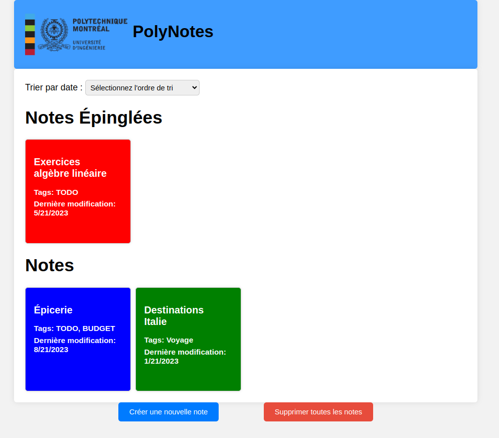
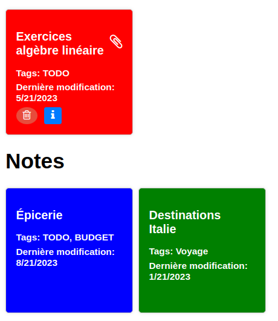
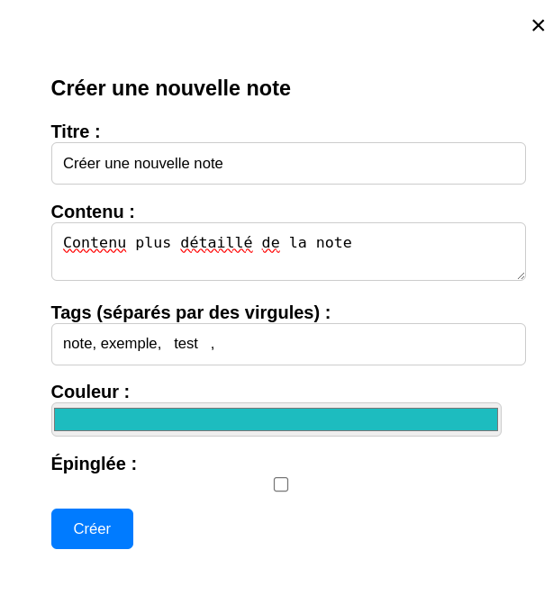
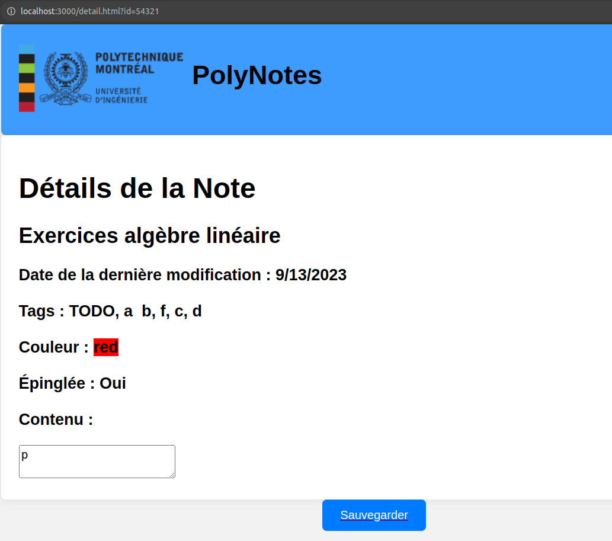
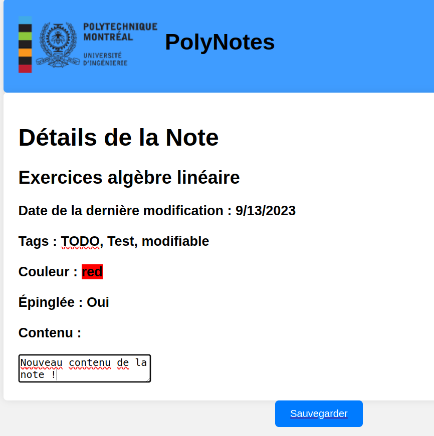

# TP2 PolyNotes

Le but de ce travail est de vous introduire au langage de programmation JavaScript et la manipulation du DOM. Vous allez vous familiariser avec la syntaxe ES2015 de JavaScript et la gestion des événements dans une page web. Finalement, vous utiliserez un outil d'analyse statique pour le respect de conventions de programmation (_linter_): ESLint. Cet outil définit un ensemble de règles à suivre pour un code uniforme et standard.

## Installation des librairies nécessaires

Pour installer les dépendances nécessaires, lancez la commande `npm ci` dans le répertoire `site-web`. Ceci installera toutes les librairies définies dans le fichier `package.json` avec les versions exactes définies dans `package-lock.json`.

## Exécution des tests

Consultez le fichier [TESTS.MD](./TESTS.MD) pour plus d'informations sur les tests du travail. Vous aurez à implémenter certains tests, vous-mêmes dans ce travail pratique.

## Analyse statique du code

Vous utiliserez l'outil d'analyse statique (_linter_) `ESLint`. Cet outil permet de vérifier que votre code respecte un certain nombre de règles définies dans le fichier de [configuration](./site-web/.eslintrc.json). Par exemple : vous ne pouvez pas utiliser le mot clé `var`, vos lignes ne peuvent pas dépasser 120 caractères, etc. Vous pouvez lancer cet outil à l'aide de la commande `npm run lint` dans votre terminal.

*Note* : il y a des _plugins_ VSCode pour ESLint qui vous indiquent les problèmes directement dans votre éditeur, mais il n'est pas garanti qu'ils sont capables de détecter tous les défauts. Vous devez vous assurer que les défauts sont corrigés en exécutant l'outil en ligne de commande.

## Déploiement local

Vous pouvez faire un déploiement local de votre site avec l'outil `http-server`. Si vous lancez la commande `npm start` dans le répertoire `site-web`, un serveur HTTP statique sera déployé sur votre machine et votre site sera accessible sur l'adresse `localhost:3000` ou `<votre-adresse-IP>:3000`. La sortie dans le terminal vous donnera l'adresse exacte d'accès.

## Description du travail à compléter

Dans le cadre de ce travail, vous allez développer un gestionnaire de notes similaire à [Google Keep](https://keep.google.com/). Vous devez pouvoir créer, modifier et supprimer des notes à travers votre site web. Les notes seront persistées en utilisant l'API `Storage` de votre navigateur.

Voici un exemple d'un objet `Note` disponible dans le fichier `defaultData.js` : 

```js
{
  id: "54321",
  title: "Exercices algèbre linéaire",
  content: "p",
  tags: ["TODO"],
  lastEdit: new Date("2023-05-22"),
  color: "red",
  pinned: true
}
```

Certains attributs (ex: `id`), seront fixes à la création de la note et d'autres pourront être modifiés par la suite (ex : `content` ou `pinned`).

Le code à compléter dans les différents fichiers sera indiqué par un marqueur **TODO**. Vous n'aurez pas besoin à modifier le HTML ou le CSS fournis. Le fichier [utils.js](./site-web/src/assets/js/utils.js) vous est fourni avec quelques fonctions utilitaires pour vous aider avec les différentes fonctionnalités à compléter.

### Gestion de la persistance des notes

Votre site doit gérer la persistance des notes en utilisant l'API `Storage`, spécifiquement, `Local Storage` de votre navigateur. À cette fin, vous devez compléter la classe `StorageManager` qui permet d'ajouter, récupérer, modifier ou supprimer les notes de votre site. Cette classe sera utilisée par plusieurs d'autres classes dans les deux pages du site.

La fonction utilitaire `populate` qui ajoute le contenu du fichier [defaultData.js](./site-web/src/assets/js/defaultData.js) dans le storage vous est fournie pour vous aider à démarrer le projet. Vous ne devez pas avoir à l'appeler pour votre remise finale. Lisez les commentaires **TODO** dans les entêtes des fonctions pour comprendre les implémentations demandées pour ce travail.

_Note_ : la clé `notes` utilisée pour le storage est également utilisée dans les tests de Cypress. Veuillez ne pas la modifier. 

### Page principale

La page contient 2 listes en fonction de l'attribut `pinned` de chaque note. La page principale présente un sous-ensemble des informations de chaque note de l'application : le `content` de la note n'y est pas présent.

L'affichage de la page est le suivant :

<div style="display:flex; justify-content:center; width:100%; margin:20px">
    
</div>

Le HTML/CSS de la page vous est fourni, mais vous devez construire le HTML des notes à travers le code JS. Un exemple statique du résultat voulu vous est fourni dans le code de départ. Vous devez implémenter la construction dans la fonction `createHTMLNote` de la classe `NoteLibrary`.

Chaque note possède, en haut à droite, une icône qui permet de changer son état épinglé à travers un clic. Cette icône est visible seulement si vous survolez la note avec la souris. Un changement de l'état devrait mettre à jour le visuel de la page en retirant la note de sa liste et plaçant dans l'autre.

Il est possible de **sélectionner** une note en cliquant dessus. Ceci fait apparaître les icônes de suppression (classes `fa fa-trash-o`) et détails de la note (classes `fa fa-info`). Consultez l'image plus bas pour un exemple et les sections suivantes pour le fonctionnement de ses icônes.

<div style="display:flex; justify-content:center; width:100%; margin:20px">
    
</div>

La classe `NoteLibrary` implémente la logique de gestion des notes dans le système. Lisez les commentaires **TODO** dans les entêtes des fonctions pour comprendre les implémentations demandées pour ce travail. Notez que cette classe utilise la classe `StorageManager` et est utilisée par `MainPageEventsController` à son tour.

La classe `MainPageEventsController` implémente la gestion des actions de l'utilisateur dans la page principale. Son comportement est décrit dans les sections suivantes.

#### Tri des notes

Vous devez implémenter une gestion des tris des notes en fonction de leur date de dernière modification. Lorsqu'un utilisateur utilise le menu déroulant en haut de la page, il doit voir les listes de notes mises à jour en fonction de l'option choisie. Vous devez implémenter cette gestion dans la fonction `sortListener` de la classe `MainPageEventsController`.

#### Suppression des notes

Cliquer sur l'icône de suppression d'une note sélectionnée devrait supprimer la note et mettre à jour le visuel. Ceci devra être implémenté dans la classe `NoteLibrary`.

Vous devez implémenter la suppression complète de toutes les notes à travers un bouton dans l'interface. Cette suppression doit mettre à jour l'interface et la persistance des données. Vous devez implémenter la suppression complète dans la fonction `deleteAllListener` de la classe `MainPageEventsController`. 

#### Gestion des raccourcis

Vous devez gérer les 2 raccourcis clavier suivants lorsqu'une note est sélectionnée. Le comportement doit être le même que l'utilisation d’icônes avec la souris et la page doit être mise à jour correctement :
- <kbd>P</kbd> : l'état épinglé de la note est inversé.
- <kbd>Del</kbd> (boutton `Supprimer`) : la note est supprimée.

Ces raccourcis ne devraient avoir aucun effet s'il n'y a aucune note de sélectionnée au moment de leur utilisation. Vous devez implémenter cette gestion dans la fonction `addKeyBoardEvents` de la classe `MainPageEventsController`.

### Création d'une nouvelle note

Le bouton _Créer une nouvelle note_ dans la page principale permet d'ouvrir le dialogue de création suivant :

<div style="display:flex; justify-content:center; width:100%; margin:20px">
    
</div>

Notez l'utilisation de l'élément [dialog](https://developer.mozilla.org/en-US/docs/Web/HTML/Element/dialog) pour le formulaire de création.

La note doit avoir un titre, un contenu et des étiquettes (_tags_). La couleur noire est utilisée et la note n'est pas épinglée par défaut. Les tags sont séparés par des virgules et ne peuvent pas être vides et les espaces au début et/ou la fin sont ignorés. Vous n'avez pas à gérer la duplication de tags (2 tags avec la même valeur).

Une fois le bouton _Créer_ appuyé, la note doit être sauvegardée, la modale fermée et les listes des notes mises à jour avec la nouvelle note. Notez que vous devez empêcher le comportement de soumission par défaut du formulaire et gérer l'événement de soumission vous-mêmes.

Vous devez compléter la classe `MainPageEventsController` qui contient le contrôle de la modale et la logique de gestion de la soumission de formulaire de création. La fonction `getNoteDetailsFromModal` vous est partiellement fournie, mais doit être complétée par vous. 

### Page de détails et modification d'une note

Cliquer sur l'icône de détails d'une note sélectionnée devrait rediriger vers la page `detail.html?id=XYZ` où `XYZ` est l'`id` de la note. Si la page est accédée directement, avec un `id` qui ne correspond à aucune note sauvegardée, le message `La note demandée n'existe pas.` est affiché à l'écran.

Le HTML/CSS général de la page vous est fourni, mais vous devez construire le HTML des informations à travers le code JS. La page contient l'ensemble des informations de la note, sauf son `id`. L'arrière-plan de l'information sur la couleur de la note doit être de cette couleur.

L'affichage initial de la page est le suivant :

<div style="display:flex; justify-content:center; width:100%; margin:20px">
    
</div>

Le logo de Polytechnique devrait rediriger l'utilisateur vers la page principale.

Le code dans le fichier [noteEditor](./site-web/src/assets/js/noteEditor.js) contient l'ensemble du code à compléter pour cette page. La classe `NoteEditor` gère l'état de la note et les fonctions `saveChangesByIdListener` et `addKeyBoardEvents` gèrent les interactions de l'utilisateur avec la page. Lisez les commentaires **TODO** dans les entêtes des fonctions pour comprendre les implémentations demandées pour ce travail.

#### Modification d'une note

La page permet de modifier le contenu et les _tags_ d'une note. Le contenu doit être présenté dans une balise `<textarea>` et les _tags_ dans une balise `<p>` modifiable. La modification est confirmée à travers le bouton `Sauvegarder` en bas de la page.

Tout comme la création d'une note, les tags sont séparés par des virgules et ne peuvent pas être vides, mais vous n'avez pas à gérer la duplication de tags.

L'affichage d'une modification en cours est le suivant :

<div style="display:flex; justify-content:center; width:100%; margin:20px">
    
</div>

Une fois la note modification confirmée, la date de dernière édition (attribut `lastEdit`) de la note est mise à jour et l'utilisateur est redirigé vers la page principale. La page principale doit afficher les nouvelles informations de la note.

Vous devez implémenter cette gestion dans la fonction `saveChangesByIdListener`.

#### Gestion des raccourcis

Vous devez gérer les mêmes raccourcis que la page principale (<kbd>P</kbd> et <kbd>Del</kbd>). Contrairement à la page principale, le site doit demander une [confirmation](https://developer.mozilla.org/en-US/docs/Web/API/Window/confirm) validée avant de supprimer la note. Ces raccourcis ne devraient pas avoir un effet si l'édition d'un des champs modifiables est en cours (le champ a le focus).

Vous devez implémenter cette gestion dans la fonction `addKeyBoardEvents`.

#### Tests unitaires

Vous devez compléter les tests unitaires pour la classe `NoteEditor`. Consultez le fichier [TESTS.MD](./TESTS.MD) pour plus d'informations.

## Fonctionnalité bonus

Un point bonus sera donné pour l'ajout de fonctionnalité de modification de la couleur d'arrière-plan dans la page de détails d'une note. Cette modification doit être persistante et être visible dans l'interface des deux pages. Cette fonctionnalité ne doit pas rentrer en contradiction avec les autres fonctionnalités demandées dans le cadre du TP.

**Note** : la note maximale pour ce travail ne peut pas dépasser 20/20.

# Correction et remise

La grille de correction détaillée est disponible dans [CORRECTION.MD](./CORRECTION.MD). Le navigateur `Chrome` sera utilisé pour l'évaluation de votre travail. L'ensemble des tests fournis doivent réussir lors de votre remise. Les tests ajoutés par l'équipe doivent aussi réussir.

Le travail doit être remis au plus tard le lundi 23 octobre à 23:55 sur l'entrepôt Git de votre équipe. Le nom de votre entrepôt Git doit avoir le nom suivant : `tp2_matricule1_matricule2` avec les matricules des 2 membres de l’équipe.

**Aucun retard ne sera accepté** pour la remise. En cas de retard, la note sera de 0.