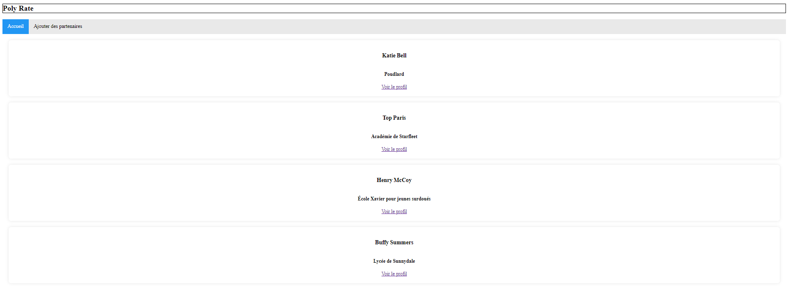
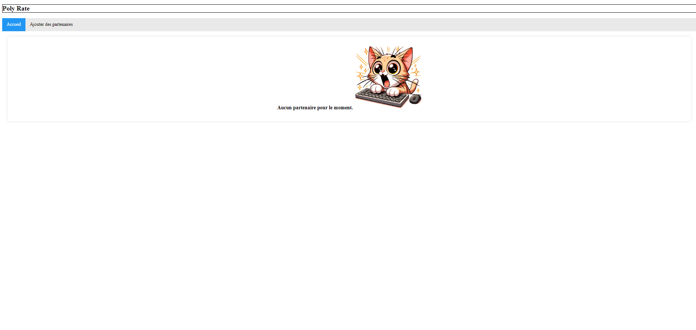
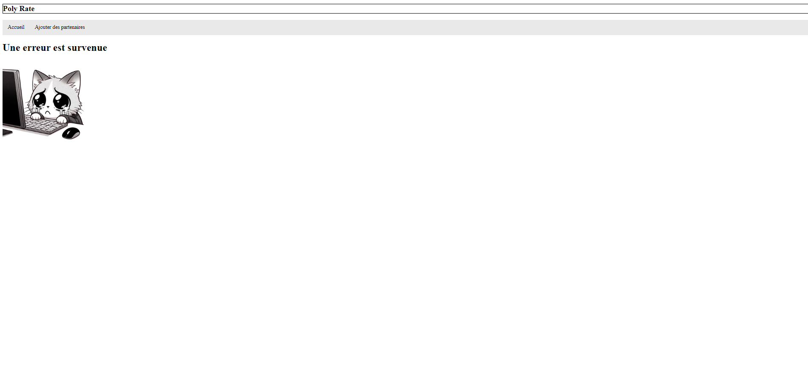
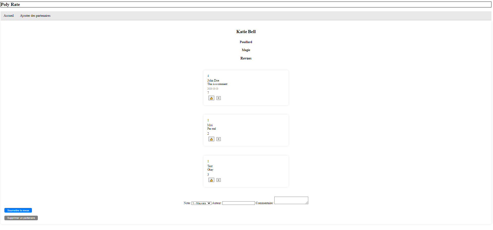
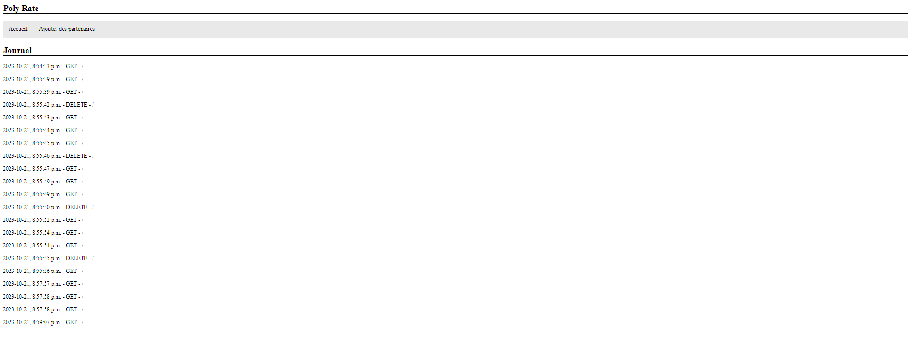

# TP3 PolyRate

## Mise en contexte et objectifs du travail pratique

Ce travail pratique vise à vous familiariser avec Node.js, Express, et les principes des communications HTTP via la création d'un site web interactif et un serveur dynamique. 

Le site web permettra aux utilisateurs de fournir des évaluations et des commentaires sur les partenaires de laboratoires. Il s'agit d'une application pratique qui simule un système de notation et de retroaction pour des partenaires de travaux pratique pour les différentes communautés étudiantes d'un peu partout dans le monde.

Votre objectif principal est de développer un serveur dynamique interactif en utilisant Node.js et Express. Votre application permettra aux utilisateurs de soumettre des commentaires et des notes pour leurs partenaires de laboratoires. Il sera également possible d'ajouter des nouveaux partenaires à évaluer.

Un système rudimentaire de journalisation (`logging`) sera mis en place pour enregistrer tous les accès au serveur.

Les données seront sauvegardées dans de simple fichiers JSON (`logs.json`, `partners.json` et `reviews.json`), ce qui vous permettra de vous familiariser avec l'accès au système de fichiers à travers le module `fs`.

## Installation des librairies nécessaires

Pour installer les dépendances nécessaires, lancez la commande `npm ci` dans le répertoire `site-web` ET le répertoire `server`. Ceci installera toutes les librairies définies dans le fichier `package.json` avec les versions exactes définies dans `package-lock.json`.

## Déploiement local

Vous pouvez faire un déploiement local de votre serveur statique avec l'outil `http-server`. Si vous lancez la commande `npm start` dans le répertoire `site-web`, un serveur HTTP statique sera déployé sur votre machine et votre site sera accessible sur l'adresse `localhost:3000` ou `<votre-adresse-IP>:3000`. La sortie dans le terminal vous donnera l'adresse exacte d'accès.

Vous pouvez faire un déploiement local de votre serveur dynamique utilisant Node.js. Si vous lancez la commande `npm start` dans le répertoire `server`, votre serveur sera déployé sur votre machine et sera accessible sur l'adresse `localhost:5020` ou `<votre-adresse-IP>:5020`.

## Description du travail à compléter

Il est conseillé de lire l'ensemble du travail demandé et d'implémenter les fonctionnalités une à la fois sur le serveur ET le site web. Vous pouvez également commencer par implémenter le code côté serveur en premier avant de vous attaquer au site web.

### Format des données

Consultez les fichiers `partners.json` et `reviews.json` dans le répertoire `data` pour des exemples de la structure des objets à manipuler. Le résultat des manipulations de votre système doivent produire des objets ayant la même structure. Le code qui génère des `id` aléatoires pour vos objects vous est fourni.

### Serveur

Puisque nous voulons que notre application soit dynamique, vous devez implémenter un serveur responsable de la gestion des requêtes HTTP sur différentes routes. Pour ce faire, vous allez utiliser la librairie Express.js. Vous pouvez vous familiariser avec la documentation de [Express](https://expressjs.com/fr/api.html) pour vous aider à compléter ce travail.

Vous devez ajouter des gestionnaires de routes sur les 3 racines suivantes à votre serveur Express :
- `/logs`
- `/api/partners`
- `/api/reviews`

#### Fichiers fournis

Les fichiers `fileManager.js` et `logsManager.js` sont implémentés pour vous. Ces fichiers sont responsables respectivement de la gestion des fichiers JSON et de la gestion des journaux. Vous devez utiliser ces fichiers pour compléter les middlewares.

### Système de journalisation

Vous devez implémenter un middleware générique de journalisation (`logs`). Ce middleware est partiellement implémenté dans le fichier `requestLogger.js` et doit enregistrer l'ensemble des requêtes HTTP faites au serveur, peu importe l'URI demandé.

Le fichier `requestLogger.js` est responsable de la gestion des logs. Vous devez compléter ce fichier pour qu'il puisse correctement effectuer les opérations suivantes :
- Mettre à jour le fichier JSON contenant les logs avant de passer au reste du traitement.

Si le middleware est correctement implémenté, vous verrez une journalisation des accès à des routes spécifiques de votre serveur, accompagnés de la date,heure et méthode HTTP utilisée. 

### Gestion des requêtes HTTP

La gestion des requêtes doit être implémentée dans des routeurs dédiés attachés à votre serveur dans le fichier `server.js` (Voir les racines à utiliser plus haut). Les routeurs doivent être configurés pour répondre aux requêtes HTTP pour la gestion des partenaires et des revues.

Les routeurs `partners.js` et `reviews.js` sont partiellement implémentés pour vous. Vous devez compléter ces fichiers pour qu'ils puissent correctement effectuer les bonnes opérations selon les routes demandées en vous basant sur les middlewares. Lisez bien les TODOs fournis. Notez que dans le cas de la suppression d'un partenaire, toutes les revues qui lui sont associées devront également être supprimées.

Vous devez choisir les méthodes HTTP et les codes de retour à utiliser. **Il est important de porter une attention particulière à la sémantique des requêtes et réponses HTTP.** 

On vous demande également d'implémenter la gestion des erreurs : soit du serveur ou des requêtes incomplètes ou mal structurées. 

#### Gestion des partenaires

Le fichier `partnerManager.js` est partiellement implémenté pour vous. Ce fichier est responsable de la gestion des partenaires. Vous devez compléter ce fichier pour qu'il puisse correctement effectuer les opérations suivantes :
- Ajouter un nouveau partenaire
- Supprimer un partenaire
- Récupérer les partenaires du fichier JSON
- Récupérer un partenaire spécifique selon son id

#### Gestion des revues

Le fichier `reviewManager.js` est partiellement implémenté pour vous. Ce fichier est responsable de la gestion des évaluations. Vous devez compléter ce fichier pour qu'il puisse correctement effectuer les opérations suivantes :
- Ajouter une nouvelle évaluation
- Récupérer les revues du fichier JSON
- Récupérer les revues d'un partenaire spécifique selon son id
- Incrémenter le nombre de "likes" d'une évaluation spécifique selon son id

### Tests

Veuillez consulter le fichier [TESTS.MD](./TESTS.MD) pour plus d'informations sur les tests du travail. Vous aurez à implémenter certains tests du routeur `reviews`.

## Site web

On vous fournit un site web avec plusieurs fonctionnalités déjà implémentées pour vous. Les fonctionnalités manquantes vont vous permettre d'interagir avec le serveur. Vous devez compléter le code fourni pour effectuer les bonnes requêtes HTTP vers le serveur. 

**Il est important de porter une attention particulière à la sémantique des requêtes HTTP.**

### Gestionnaire de requêtes

Le fichier `HTTPManager.js` est partiellement implémenté pour vous. Ce fichier est responsable de la gestion des requêtes HTTP. Vous devez compléter ce fichier pour qu'il puisse correctement effectuer les appels vers le serveur. Les méthodes `GET` et `POST` sont implémentées pour vous. Vous devez implémenter les autres méthodes nécessaires pour compléter l'application.

### Page principale

La page principale `index.html` présente une liste avec tous les partenaires disponibles dans le système avec un lien vers leur propre page.

Le fichier `index.js` est partiellement implémenté pour vous. Ce fichier est responsable de la gestion de l'affichage de la page principale. Notez que l'utilisation de `innerHTML` dans le code est seulement à des fin de brièveté pour ce travail pratique.

Vous devez compléter ce fichier pour qu'il puisse correctement effectuer les opérations indiquées dans les TODOs.

Voici le visuel de la page principales avec et sans données du serveur:

#### Avec des partenaires 

#### Sans partenaires

### Ajout d'un partenaire

La page `add.html` présente un formulaire qui permet de rajouter un nouveau partenaire au système à travers une requête HTTP.

Le fichier `add.js` est partiellement implémenté pour vous. Ce fichier est responsable de la gestion de l'ajout d'un partenaire. Notez qu'il n'y a pas de validation des données sur la page web : la validation doit avoir lieu sur le serveur.

Vous devez compléter ce fichier pour qu'il puisse correctement effectuer les opérations indiquées dans les TODOs. En cas de création réussie, l'utilisateur est averti (avec un `window.alert()` par exemple) et redirigé vers la page principale. En cas d'échec de création, l'utilisateur est plutôt redirigé vers la page `error.html`.

#### Vue erreur (`error.html`)

### Gestion des partenaires

La page `partner.html?id=xyz` présente les informations sur le partenaire ayant l'id `xyz`, ainsi que l'ensemble des revues associées à ce partenaire. 

Le fichier `partner.js` est partiellement implémenté pour vous. Ce fichier est responsable de la gestion de l'affichage des partenaires. Vous devez compléter ce fichier pour qu'il puisse correctement effectuer les opérations indiquées dans les TODOs.

Chaque revue possède 2 boutons : un qui permet d'aimer ("like") la revue et un qui permet de supprimer la revue. Lorsqu'un utilisateur clique sur un des boutons et votre serveur traite la requête, il doit voir une retroaction sans avoir à recharger la page : le compteur de "like" incrémente ou la revue est retirée de la liste.

Le bouton à la fin de la page permet de supprimer le partenaire. En cas de suppression réussie, l'utilisateur est averti (avec un `window.alert()` par exemple) et redirigé vers la page principale. En cas d'échec de suppression, l'utilisateur est averti, mais n'est pas redirigé ailleurs.

La page permet de rajouter une nouvelle revue pour le partenaire spécifique. Notez qu'il n'y a pas de validation des données sur la page web : la validation doit avoir lieu sur le serveur. Une soumission réussie doit mettre à jour la page avec la nouvelle revue affichée dans la liste.

#### Vue d'un partenaire (`partner.html`)

### Page de journalisation

La page `log.html` est une page "cachée" visible seulement à travers l'URL `<votre-serveur-statique>:3000/log` qui affiche l'ensemble des journaux récupérés de votre serveur. Cette fonctionnalité est déjà implémentée pour vous.

#### Vue de journalisation (`logs.html`)

## Fonctionnalité bonus

Dans la version de base de votre projet, on peut seulement incrémenter le nombre de "like" d'une revue. Comme fonctionnalité bonus, vous devez ajouter la possibilité de "dislike" (mettre je n'aime pas) à une revue et imposer une valeur minimale de 0 au compteur de "like". Vous devez cependant respecter la contrainte suivante : cette nouvelle fonctionnalitée doit être implémentée à travers le même gestionnaire de route que la fonctionnalité de "like" une revue. Vous pouvez modifier le format de la requête HTTP et de ses données envoyées à votre guise, en autant que la fonctionnalité de "like" demeure fonctionnelle.

La mise à jour l'interface du site web pour cette fonctionnalité est laissée à votre choix. La valeur du nombre de "like" doit être quand même présent pour chaque revue.

**Note** : la note maximale pour ce travail ne peut pas dépasser 20/20.

# Correction et remise

La grille de correction détaillée est disponible dans [CORRECTION.MD](./CORRECTION.MD). Le navigateur `Chrome` sera utilisé pour l'évaluation de votre travail. L'ensemble des tests fournis doivent réussir lors de votre remise. Les tests ajoutés par l'équipe doivent aussi réussir.

Le travail doit être remis au plus tard le lundi 13 novembre à 23:55 sur l'entrepôt Git de votre équipe. Le nom de votre entrepôt Git doit avoir le nom suivant : `tp3_matricule1_matricule2` avec les matricules des 2 membres de l’équipe.

**Aucun retard ne sera accepté** pour la remise. En cas de retard, la note sera de 0.