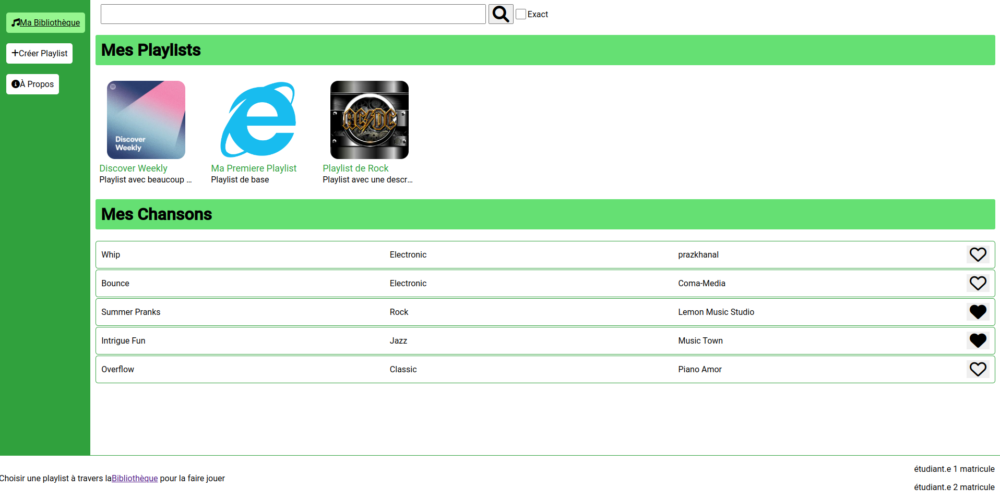
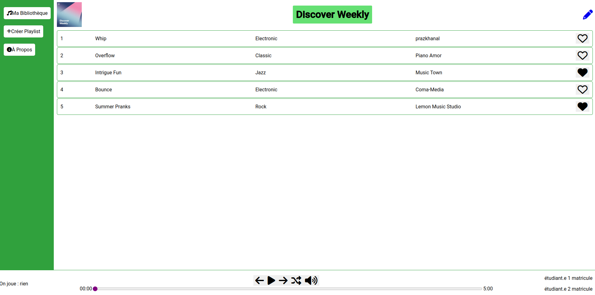
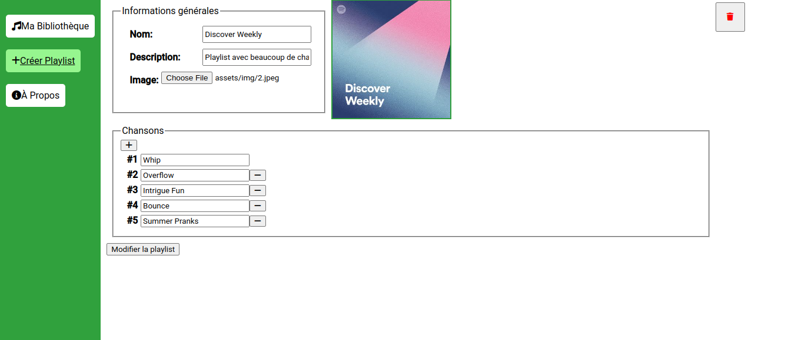

# TP4 PolyPlay

# Mise en context et objectifs du travail pratique

Le but de ce travail pratique est de vous familiariser avec le développement d'une application web full stack utilisant une base de données pour assurer la persistance des données. Pour ce faire, vous utiliserez la librairie React pour le côté client et vous vous connecterez à une base de données MongoDB à partir d'un environnement NodeJS/Express pour le côté serveur.

L'application à compléter est un système de gestion de listes de chansons (_playlists_) qui permet à l'utilisateur de créer, modifier et supprimer des listes de chansons ainsi que d'écouter les chansons d'une liste spécifique. Le lecteur de musique peut être contrôlé à travers l'interface ou des raccourcis (présentés à la page `/about` à l'aide de la composante `About`).

Le code source fourni contient deux applications distinctes, soit une application ReactJS (répertoire `site-web`) ainsi qu'une application NodeJS/Express (répertoire `server`). L'application React est constituée de composantes qui se retrouvent dans les répertoires `components` et `pages`.
Le serveur, pour sa part, comprend des contrôleurs, des services et des données par défaut que vous pourrez retrouver dans `server/controllers`, `server/services` et `server/data`. C'est le fichier `server.js` qui sera exécuté au lancement du serveur.

## Configuration de la base de données

Vous devez configurer une instance MongoDB pour la persistance de vos données. Vous devez utiliser le service [Cloud Atlas](https://www.mongodb.com/cloud/atlas).

Vous devez configurer votre instance avant de pouvoir effectuer le travail demandé. Un guide pour la configuration d'instances MongoDB avec Cloud Atlas est disponible sur le projet [GitHub du cours](https://github.com/LOG2440/Cours-11-MongoDB/blob/master/README.MD) de l'exemple sur MongoDB présenté en classe.

Le fichier `env.js` contient les constantes avec les informations de connexion à votre instance MongoDB. Vous devez les remplacer avec les bonnes valeurs de votre propre instance. 

## Installation des librairies nécessaires

Pour installer les dépendances nécessaires, lancez la commande `npm ci` dans la racine de chaque application (et donc deux fois au total). Ceci installera toutes les librairies définies dans le fichier `package-lock.json`. Vous pouvez par la suite utiliser les libraires de test (pour le serveur) et les scripts définis dans le même fichier.

## Déploiement local

Lors du développement, vous pouvez faire un déploiement local de votre application ReactJS et de votre serveur dynamique avec la commande `npm start`. Notez bien qu'il faut exécuter la commande à la racine de chaque application (dans `/site-web` et `/server`) dans deux consoles distinctes afin que les deux fonctionnent en parallèle.

Le serveur statique sera déployé à l'adresse `localhost:5010` (ou `<votre-adresse IP>:5010`). Le serveur dynamique sera déployé à l'adresse `localhost:5020` et commencera à écouter le port 5020.

# Description du travail à compléter

Il est conseillé de lire l'ensemble du travail demandé et d'implémenter les fonctionnalités une à la fois sur le serveur ET le site web. Vous pouvez également commencer par implémenter le code côté serveur en premier avant de vous attaquer au site web.

## Format des données et les données initiales

Consultez les fichiers `playlists.json` et `songs.json` dans le répertoire `data` pour des exemples de la structure des objets (`Playlist` et `Song`) à manipuler. Le résultat des manipulations de votre système doivent produire des objets ayant la même structure. Ces objets seront utilisés comme des données initiales pour votre système. La persistance et toute donnée supplémentaire sera gérée par votre base de données MongoDB. 

## Serveur dynamique

Vous devez établir la communication avec une base de données MongoDB à partir de votre serveur dynamique. Pour ce TP, on vous demande de placer les différentes données dans 2 collections séparées nommées `playlists` et `songs`.

Lors du lancement du serveur dans `server.js`, celui-ci se connecte à la base de données et ajoute les données initiales dans ces collections, seulement si les collections sont vides. Ceci vous permettra d'avoir des données initiales avec lesquelles tester votre système.

Vous devez implémenter les fonctionnalités présentes dans les classes `PlaylistService`, `SongService` et `DatabaseService` qui représentent les services principaux dans votre système. La classe `SearchBarService` est implémentée pour vous, mais fera appel aux fonctions que vous aurez à implémenter. 

Vous n’avez pas besoin de modifier les contrôleurs ni la configuration du serveur (sauf pour le TODO dans `server.js`). Chaque fonction à implémenter contient le mot clé TODO dans son en-tête. Les fonctions à compléter retournent des valeurs vides afin de permettre l’exécution du code, mais vous devez modifier ces valeurs de retour.

### DatabaseService

Vous devez implémenter la fonction `populateDb` qui remplit une collection avec des données seulement si la collection est vide. Cette fonction est exécutée lors du lancement du serveur et remplit la BD avec les valeurs des 2 fichiers JSON du répertoire `data` du projet. Si les collections de la BD contiennent déjà des valeurs, aucune modification ne devra avoir lieu. 

### PlaylistService

Ce service s'occupe des playlists et leurs manipulations sur la base de données. Consultez les en-têtes des fonctions à implémenter ainsi que les tests présents dans `playlist.service.test.js` pour bien comprendre le fonctionnement des méthodes. Notez que lors d'une sauvegarde, l'image (_thumbnail_) du playlist est sauvegardée localement sur votre machine et non sur la BD. La méthode `deletePlaylist` vous est fournie à titre d'exemple.

### SongService

Ce service s'occupe des chansons et leurs manipulations sur la base de données. Consultez les en-têtes des fonctions ainsi que les tests présents dans `songs.service.test.js` pour bien comprendre le fonctionnement des méthodes. Contrairement aux playlists, les fichiers audio sont sauvegardés sur disque et seulement les métadonnées sur la base de données. Une chanson ne peut pas être supprimée à travers votre système, mais elle peut être marquée comme aimée (_liked_) ou non, ce qui aura un impact dans l'affichage du côté du site web.

### SearchBarService

Le code de la fonction `search` vous est déjà fourni. Vous devez compléter les fonctions `search` des autres services qui vont effectuer la recherche par mot clé.

Le code initial fourni dans ces 2 méthodes effectue une recherche seulement sur l'attribut `name` et n'est pas sensible à la case (paramètre : `$options: "i"`. ) Vous devez modifier la recherche pour tenir compte des autres champs possibles et tenir compte du paramètre `exact` (recherche sensible à la case). *Astuce* : l'opérateur logique [$or](https://www.mongodb.com/docs/manual/reference/operator/aggregation/or/) de MongoDB vous sera utile.

La recherche se fait sur une sous-chaîne dans les attributs. Par exemple, la recherche `Co` sans attribut `exact` devrait retourner les playlists "Discover Weekly" et "Playlist de Rock" (mot `beaucoup` dans sa description) ainsi que la chanson "Bounce" dont l'artiste est `Coma-Media`. La même recherche avec attribut `exact` devrait retourner la chanson seulement et `co` + `exact` devrait retourner les 2 playlists (sensible à la case).

## Site web

Vous allez utiliser le patron [SAM](https://sam.js.org/) et le concept de `Reducer` pour gérer les actions envoyées par les composantes et modifier l'état de la playlist en cours. Chaque action contient obligatoirement un type et, optionnellement, un contenu (`payload`). Par exemple : `{type: ACTIONS.PLAY, payload : { index: 1}}`. Le fichier `reducer.js` contient le `Reducer` utilisé. Lisez bien le code fourni pour comprendre la bonne formulation des actions à envoyer.

### Composantes de pages

Le répertoire `pages` contient l'ensemble des composantes React qui définissent les différentes "pages" de votre site web. Le site possède 4 pages : `/index` (Page principale), `/about` (À propos), `/playlist/:id` (Playlist spécifique) et `/create_playlist/:id` (Formulaire de création/édition d'une playlist). Comme vous avez un site monopage (_SPA_), toutes ces pages sont des composantes React dans le même document HTML. Vous devez configurer correctement les routes vers chacune des pages dans le fichier `App.jsx` pour s'assurer que chaque URL est lié à la bonne composante à afficher.

La composante `About` (page à propos) vous est fournie et vous n'avez pas à la modifier. Les autres composantes contiennent le mot clé **TODO** aux endroits à compléter.

#### Page Principale (Index.jsx)

Cette page affiche les playlists du système ainsi qu'une liste complète des chansons avec leurs informations. Voici le visuel avec les donnes initiales fournies : 

Vous devez compléter la recherche par mot clé dans la fonction `handleSearch`. Notez que cette fonction est utilisée par la composante `SearchBar` qui doit être ajoutée dans le HTML généré. Vous devez compléter la récupération des chansons et leur affichage à l'aide de composantes `Song`. La gestion des playlists à l'aide de composantes `Playlist` vous est donnée à titre d'exemple.

#### Page Playlist (Playlist.jsx)

Cette page affiche les informations d'une playlist et permet de jouer les chansons de la playlist une après l'autre. Voici son visuel : 

Vous devez charger les bonnes données dans votre gestionnaire d'état (`reducer`) à l'aide de l'action appropriée. Vous devez compléter le HTML de la composante pour le chargement des chansons. Notez que contrairement à `Index`, les chansons ici ont un affichage et un comportement différent contrôlé par la propriété `index` comme sera expliqué plus bas. Vous devez ajuster le code de génération de composantes en conséquence.

### Formulaire de création et modification (CreatePlaylist.jsx)

Cette page permet de créer une nouvelle playlist ou en modifier une existante si on y accède à travers la page de `Playlist.jsx`. Voici son visuel dans le cas d'une modification d'une playlist. Dans le cas de création d'une nouvelle playlist, le bouton de suppression (corbeille rouge en haut à droite) ne sera pas affiché : 

La variable `data` contient l'information de la playlist à envoyer au serveur. Vous devez compléter la fonction `handleNameChange` qui gère la modification du nom de la playlist. Vous devez compléter le code dans les fonctions `handleSubmit` et `deletePlaylist` qui effectuent des requêtes à votre serveur pour supprimer ou ajouter/modifier une playlist dans le cas de `handleSubmit`. Vous devez compléter le HTML de la composante aux endroits indiqués, notamment la construction dynamique des éléments `<option>` pour le choix de chansons, la liaison des entrées de nom et description ainsi que la modification du bouton de soumission en fonction de type de formulaire utilisé.

### Autres composantes

Le répertoire `components` contient l'ensemble des autres composantes React qui définissent les différents éléments utilisés dans les composantes de pages du site web. Les composantes `SearchBar` et `Footer` vous sont fournies pour vous aider avec votre travail et vous n'avez pas à les modifier sauf pour ajouter vos noms dans `Footer`.

Les autres composantes contiennent des éléments à compléter. Le mot clé **TODO** est présent aux endroits à compléter. Vous devez compléter des fonctions ou compléter le HTML retourné par la composante en utilisant la bonne syntaxe JSX.

#### Barre de navigation (NavBar.jsx)

Cette composante est partagée par toutes les pages.

Vous devez ajouter les bons liens vers les pages `/index`,`/create_playlist` et `/about` en utilisant les bons éléments de la librairie `react-router-dom` et non la balise `<a>`. Référez-vous aux captures d'écran plus haut pour le visuel attendu.

#### Chanson (Song.jsx)

Cette composante est utilisée dans `Index.jsx` et `Playlist.jsx`, mais n'a pas le même comportement à chaque fois en fonction de la propriété `index` en paramètre.

Vous devez lier la fonction `toggleLike`, qui effectue une demande de changement du statut aimé d'une chanson à votre serveur, au bouton de la composante seulement lorsque la propriété `index` n'est pas présente (affichage dans la page principale). 

Vous devez compléter la fonction `playSong` qui envoie une action `PLAY` au `reducer` and le bon index. Cette fonction doit être disponible seulement lorsque la propriété `index` existe (affichage dans une page de playlist). On ne peut pas jouer une chanson à partir de la page principale.

Vous devez compléter le code HTML pour afficher les informations de la chanson, notamment son nom, genre et artiste. Référez-vous aux captures d'écran plus haut pour le visuel attendu. Attention à la propriété `index` et son affichage.

#### Playlist (Playlist.jsx)

Cette composante affiche la vignette et l'information d'une playlist dans la page principale (à ne pas confondre avec la page `Playlist.jsx`).

Vous devez compléter le code HTML pour les informations de la playlist choisie, notamment son image, son nom et son description. Référez-vous à la première capture d'écran pour le visuel attendu.

#### Contrôle de musique (Player.jsx)

Cette composante présente les contrôles de musique pour la chanson en cours et est disponible seulement sur la page d'une playlist. Par défaut, la 1re chanson de la playlist sera chargée, mais pas jouée par défaut. Le passage à la prochaine chanson après la fin de la chanson en cours est automatique et la playlist est jouée de nouveau si on s'y rend à la fin de ses chansons.

Vous devez compléter la gestion des différentes fonctions de contrôle de musique :
- mettre en pause/jouer (`Espace`)
- aller à la chanson précédante (`N`)
- aller à la chanson suivante (`P`)
- fermer/ouvrir le son (`M`)
- activer/fermer le mode aléatoire (_shuffle_) : la prochaine chanson choisie sera aléatoire

Notez que la chanson en cours est contrôlée par votre `reducer` et la composante ne fait qu'envoyer les actions appropriées. Vous devez compléter le code HTML pour lier l'événement de `click` de chaque bouton à la bonne fonction ainsi que l'envoi de la bonne action. L'action de jouer une chanson vous est donnée à titre d'exemple. Référez-vous à l'implémentation dans `reducer.js` pour la bonne syntaxe des actions à envoyer.

Vous devez compléter le code dans `timeline-container` pour lier les bons attributs pour le temps en cours (`timeline-current`) et la barre de progrès (`timeline`). Si le code est bien complété, vous verrez la barre de progrès avancer pendant la chanson et vous pouvez vous déplacer dans la ligne du temps avec votre souris ou les raccouris clavier `J` et `K` (+/- 5 secondes).

## Exécution des tests

Veuillez consulter le fichier [TESTS.MD](./TESTS.MD) pour plus d'informations sur les tests du travail.

## Fonctionnalité bonus

Dans la version de base de votre projet, le son est coupé dès que la composante `Player` est détruite, ce qui ne permet pas d'écouter de la musique sur l'ensemble du site (`return` dans `useEffect`). Comme fonctionnalité bonus, vous devez rendre la composante `Player` disponible et fonctionnelle partout sur le site, mais il est possible de jouer de la musique seulement si on a chargé une playlist correctement. Le son s'arrête si une nouvelle playlist est chargée.

**Note** : la note maximale pour ce travail ne peut pas dépasser 20/20.

## Liste de chansons

Les fichiers des chansons initiales sont disponibles dans le répertoire `assets/media`. Les chansons sont libres de droits et obtenues du site [pixabay](https://pixabay.com/music/). Vous pouvez ajouter des chansons supplémentaires à votre remise si vous voulez en vous assurant de mettre le fichier `.mp3` dans le répertoire `assets/media` de votre serveur. Vous pouvez mettre à jour `songs.json` pour charger les nouvelles chansons dans votre base de données au lancement initial du serveur.

# Correction et remise

La grille de correction détaillée est disponible dans [CORRECTION.MD](./CORRECTION.MD). Le navigateur `Chrome` sera utilisé pour l'évaluation de votre travail. L'ensemble des tests fournis doivent réussir lors de votre remise. Les tests ajoutés par l'équipe doivent aussi réussir.

Le travail doit être remis au plus tard le lundi 4 décembre à 23:55 sur l'entrepôt Git de votre équipe. Le nom de votre entrepôt Git doit avoir le nom suivant : `tp4_matricule1_matricule2` avec les matricules des 2 membres de l’équipe.

**Aucun retard ne sera accepté** pour la remise. En cas de retard, la note sera de 0.